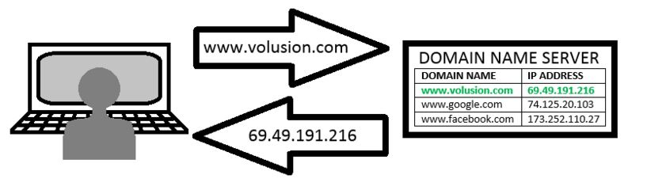

# Konsep Dasar Website

Saat seseorang membuka sebuah halaman website di browser, proses yang sebenarnya terjadi adalah sebagai berikut :

Server akan memberikan sebuah file yang disimpan dalam komputer server
Oleh karena itu, agar website himpunan bisa diakses 24 jam sehari, komputer yang menyimpan file tersebut harus hidup selama 24 jam non-stop.
Berhubung laptop/pc pribadi mustahil dinyalakan selama 24 jam nonstop, ada beberapa penyedia jasa "sewa komputer yang nyala 24 jam". Penyedia jasa ini dalam istilah sederhana-nya disebut sebagai hosting. 

## Lalu apa itu domain ?
Sebagaimana Nomor Induk Kependudukan dalam KTP, setiap komputer di internet memiliki nomor identitas masing-masing. Nomor identitas ini biasa dikenal sebagai IP Address. Setiap kali komputer berkomunikasi, mereka akan "menyapa" komputer lain dengan IP Address mereka. 

Ada 2 versi IP Address, IP versi 4 & Versi 6. Saat ini IPV4 masih populer digunakan. IPV4 terdiri dari 4 buah angka 0-255 yang dipisahkan oleh titik (contoh : 0.0.0.0 , 192.168.1.1, 8.8.8.8 , 127.0.0.1 dst..).

Untuk membuka sebuah website, sebenarnya seseorang "harus" mengetahui angka tersebut. Sebagai contoh, website google sebenarnya memiliki beberapa nomor identitas , salah satunya 74.125.200.100 (silahkan cek di browser / lihat screenshot dibawah). Karena manusia lebih sulit menghafal nama dibanding angka, maka digunakanlah domain untuk menerjemahkan antara nomor identitas komputer dengan nama tertentu yang mudah diingat. Dalam kasus google, nama domainya adalah google.com dan IP Addressnya 74.125.200.100. Kamu bisa membuka website google dengan memasukan salah satu dari IP Address atau domain-nya.

## Fasilitas di kampus

Pihak kampus melalui USDI (Unit Sumber Daya Informasi - https://ditsti.itb.ac.id/layanan-web-hosting/) menyediakan fasilitas berupa hosting dan domain &ast;.itb.ac.id gratis. Syaratnya kamu hanya perlu datang langsung ke gedung Comlabs, tanyakan bagaimana pendaftaran untuk meminta hosting dan domain gratis dari ITB. Setahu saya dulu, kamu tingal mengisi sebuah formulir dan menyerahkanya ke comlabs. Jadi, jika kamu adalah perwakilan Unit Kegiatan Mahasiswa / Himpunan, jangan malas untuk mengelola hak ini. Ini juga yang saya sesalkan kenapa tidak ada regenerasi tentang informasi hal ini.

*Catatan, terakhir kali saya cek ternyata USDI berubah menjadi ditsti dan form aplikasi online untuk request hosting &ast;.itb.ac.id tidak bisa diakses. Saran saya, datangi langsung ke comlabs urus semuanya secara offline.*

Nah, untuk kamu yang membaca ini dan kebetulan bukan kuliah di ITB, kamu bisa tanyakan kepada pihak resmi kampus kamu mengenai tata cara pendaftaran *.ac.id. Seharusnya setiap universitas memiliki kebijakan khusus mengenai hal ini.

## Saya sudah pernah mengurus hak &ast;.itb.ac.id dari USDI, tapi website saya tidak muncul ?

Salah satu hal kemungkinanya karena jatah bandwith transfer website yang kamu kelola sudah habis. Beberapa penyedia jasa hosting tertentu memiliki kebijakan untuk membatasi jumlah bandwith transfer. Pembatasan ini biasanya dilakukan oleh jasa hosting gratisan karena mereka mencoba mengefisienkan penggunaan server. Sehingga, website yang terlalu sering dibuka namun memiliki jatah bandwith yang rendah akan cepat sekali mati (tidak bisa dibuka). Solusinya adalah dengan meminta kepada pihak USDI untuk menambah bandwith transfer.

## Alur umum untuk membua website kampus
Biasanya, saat membuat website kampus dilakukan dengan beberapa tahapan :
1. Pengumpulan informasi yang dibutuhkan
2. Mengembangkan website di komputer lokal, biasanya dilakukan jika website yang dibuat cukup kompleks. Jadi website yang dibuat tidak langsung ditaruh di server melainkan di komputer personal.
3. Mengupload website di komputer lokal ke komputer server
Karena website kampus biasanya berupa website sederhana, kali ini saya akan memprioritaskan pembahasan langsung ke step 3. Insya Allah saya akan menjelaskan step 2 jika butuh.

## Mengapa Wordpress ?
Saya membahas **hanya** wordpress karena membuat website menggunakan wordpress adalah hal yang paling mudah. Dibandingkan kamu harus belajar bahasa pemrograman tertentu seperti PHP,Javascript atau CSS, saya rasa lebih mudah jika menggunakan wordpress. Selain itu, hampir seluruh kebutuhan publikasi informasi dasar bsia difasilitasi oleh wordpress. Jadi, kenapa tidak menggunakan wordpress ?
