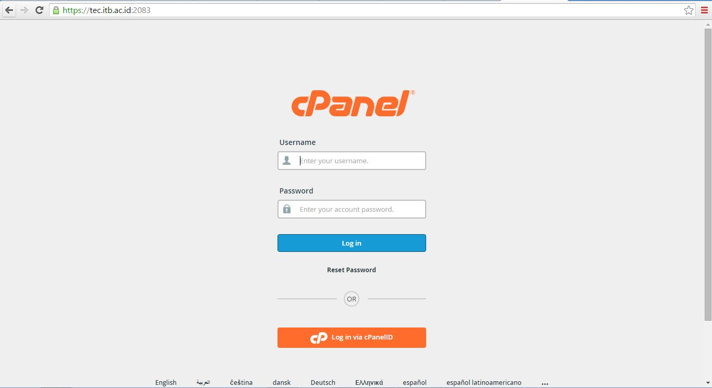
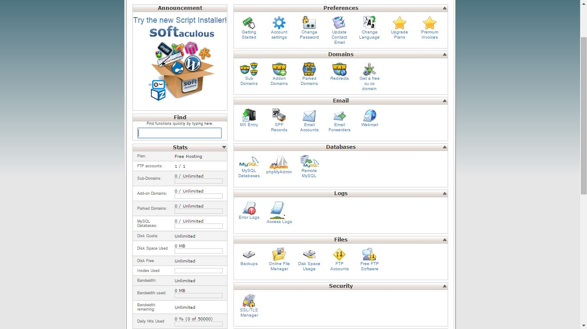
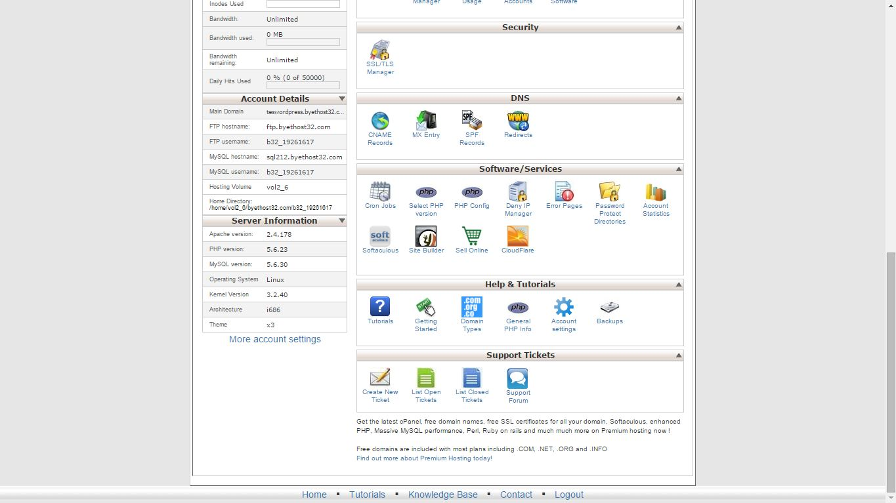
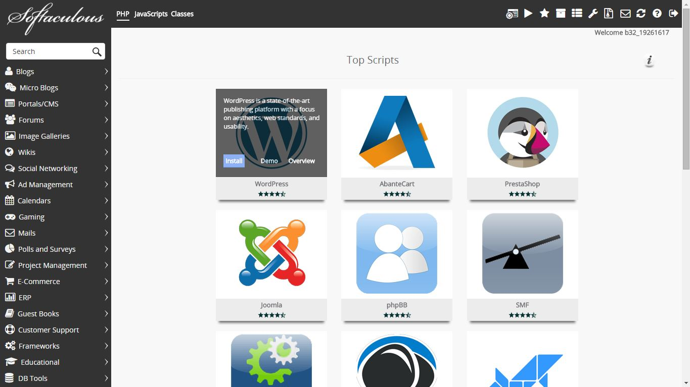
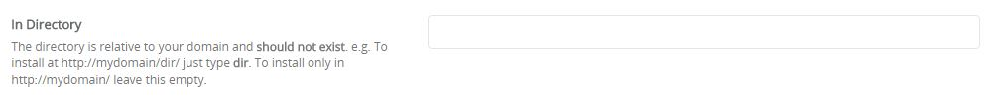
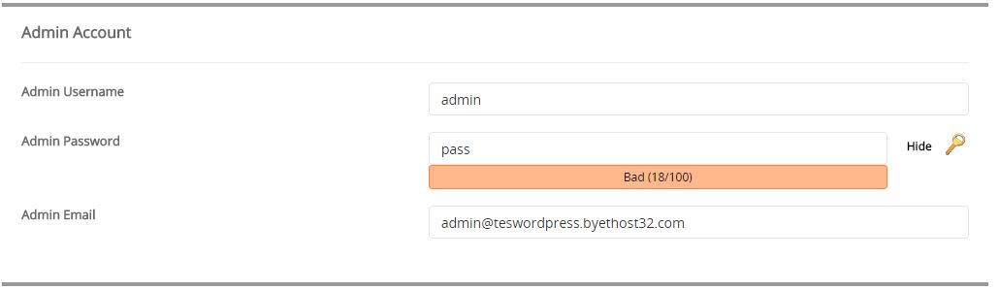
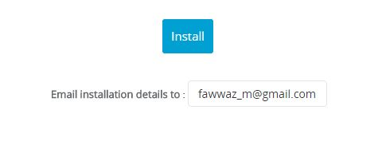

# Instalasi Menggunakan AutoInstaller

Seperti yang sudah kamu duga, instalasi menggunakan AutoInstaller akan lebih mudah dilakukan karena sebagian pekerjaan manual dilakukan secara otomatis oleh script autoInstaller. Metode ini bisa kamu pilih jika penyedia jasa hosting menyediakan fitur AutoInstaller. Beruntung, hampir seluruh penyedia jasa hosting menyediakan fasilitas ini.

---

### 1. Membuka CPanel
Hal pertama yang harus kamu lakukan adalah membuka akses ke cpanel. Untuk mencapai cpanel, kamu bisa menambahkan `/cpanel` di bagian belakang nama website kamu atau dengan menambahkan `:2083` (port 2083) pada bagian belakang nama website kamu.

Sebagai contohnya, disini saya membuka cpanel untuk domain tec.itb.ac.id menggunakan port 2083 (`http://tec.itb.ac.id:2083`), atau kamu juga bisa membukanya menggunakan `/cpanel` (http://tec.itb.ac.id/cpanel)

Silahkan login dengan Id cpanel yang diberikan dari pihak pengelola jasa hosting / USDI ITB.

### 2. Menjalankan Auto Installer
Setelah kamu berhasil login, kamu akan mendapatkan tampilan kumpulan tools yang dapat kamu gunakan untuk mengelola website. Tampilanya kurang lebih seperti berikut :

_Catatan: Karena saya sudah tidak memiliki akses ke cpanel kampus, saya mencontohkan dengan vistapanel yang kurang lebih berfungsi sama seperti 
cpanel. Jadi, jika ada sedikit perbedaan layout, harap dimaklumi._

Silahkan scrolldown ke bagian bawah hingga kamu menemukan Softaculous AutoInstaller, lalu klik icon Softaculous

Setelah kamu menekan icon tersebut, kamu akan dibawa ke halaman softaculous AutoInsatller, pilih install wordpress

Kamu akan dibawa ke halaman konfigurasi softaculous, ada beberapa hal yang perlu dilakukan disini, Pertama biarkan kosong kolom installation directory. Hal ini dilakukan karena pada umumnya website organisasi kampus diakses dengan membuka webnya secara langsung tanpa menambahkan garis miring (misal tec.itb.ac.id) bukan melalui direktori tertentu (misal : tec.itb.ac.id/nama_folder)

Selanjutnya kamu juga perlu mencatat username dan password untuk login ke wordpress. Kamu bisa membuat user/password di dalam halaman ini

Terakhir, agar kamu ingat dan tidak lupa password yang digunakan untuk wordpress, kamu bisa mengirimkan konfigurasi / setting login username & password ke alamat email kamu :

