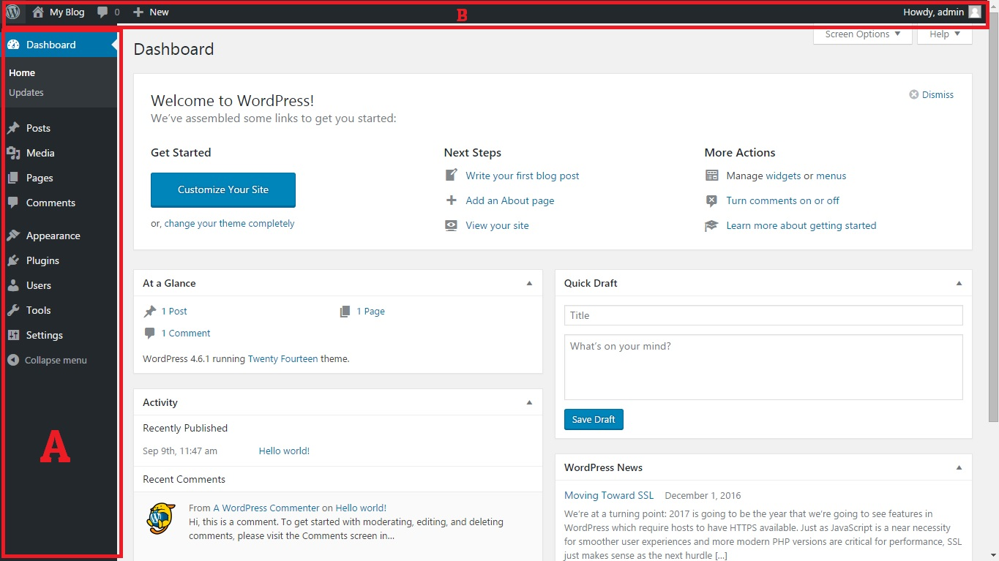

# Dashboard Wordpress

Setelah kamu berhasil login, kamu akan masuk ke bagian admin panel wordpress. Seperti control room, di dalam bagian ini kamu bisa mengelola seluruh hal yang berkaitan dengan wordpress. Berikut ini tampilan default dari wordpress setelah instalasi bersih 

Pada diagram diatas terdapat 2 bagian utama
 * A : SideMenu default dari Wordpress, menu ini mungkin akan berubah jika kamu menginstall plugin / tema tertentu
 * B : TopMenu digunakan untuk mengakses fungsi-fungsi yang sering digunkan

Jika tidak menginstall plugin/tema tertentu, secara default isi dari sidemenu adalah:
1. Dashboard
 1. Home : Berisi ringkasan umum mengenai kondisi blog kita seperti jumlah post, pages, komentar yang masuk dst..
 2. Updates : Digunakan untuk meng-upgrade instalasi wordpress jika terdapat versi yang lebih baru
2. Post
 1. All Post: Menampilkan daftar seluruh post yang pernah dibuat
 2. Add New : Membuat post baru
 3. Categories : Digunakan untuk mengelola kategori
 4. Tags : Digunakan untuk mengelola tagar
3. Media
 1. Library : Menampilkan daftar media (Gambar/Video/Rekaman audio) yang pernah diupload
 2. Add New : Menambahkan media baru ke dalam library. Setelah media dimasukan ke library, media tersebut baru bisa digunakan di dalam post/pages.
4. Pages
 1. All Pages :  Menampilkan seluruh pages yang pernah dibuat
 2. Add New : Membuat pages baru
5. Comments : Mengelola daftar komentar yang masuk, kamu bisa menghapus komentar spam disini.
6. Appearance
 1. Themes : Digunakan untuk memilih tema wordpress
 2. Customize : Digunakan untuk melakukan adaptasi dari tema wordpress yang dipilih. Beberapa tema wordpress dapat dikonfigurasi seperti memilih warna tema dst.
 3. Widgets : Digunakan untuk mengelola widgets (akan dijelaskan kemudian)
 4. Menu : Digunakan untuk megenelola menu (akan dijelaskan kemudian)
 5. Header : Digunakan untuk mengganti header dari tema yang dipilih.
 6. Background : Digunakan untuk mengganti background gambar/warna tema yang dipilih
 7. Editor : Digunakan untuk mengubah kode tema yang dipilih (Topik khusus tingkat mahir, tidak akan dijelaskan disini).
7. Plugins
 1. Installed Plugins : Digunakan untuk mengelola plugins yang sudah diinstall, mengaktifkan/upgrade plugin
 2. Add New : Menambah / Menginstall plugin baru
 3. Editor : Digunakan untuk mengubah kode plugin tertentu (Topik khusus tingkat mahir, tidak akan dibahas disini)
8. User
 1. All Users : Digunakan untuk mengelola penulis wordpress. Jika kamu ingin memiliki beberapa penulis untuk mengelola website kamu, kamu bisa menambahkanya disini
 2. Add New : Menambah Penulis baru
 3. Your Profile : Mengatur profil kamu seperti foto dst.
9. Tools (jarang digunakan)
 1. Alvailable Tools : Tools-tools ekstra untuk manajemen wordpress 
 2. Import : Digunakan untuk mengimport post dari platform blogging lainya (Misal blogspot, tumblr dst..)
 3. Export : Digunakan untuk menexport post dari website ini agar dapat diimport diwebsite lainya
10. Settings
 1. General : Pengaturan umum website, seperti tagline, url, format waktu dst
 2. Writing : Pengaturan terkait penulisan
 3. Reading : Pengaturan terkait dengan bagaimana membaca
 4. Discussion : Pengaturan terkait dengan manajemen komentar
 5. Media : Pengaturan terkait dengan media (gambar/video/audio)
 6. Permalinks : Pengaturan terkait format link website