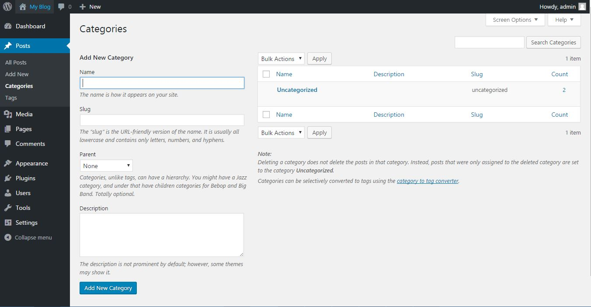
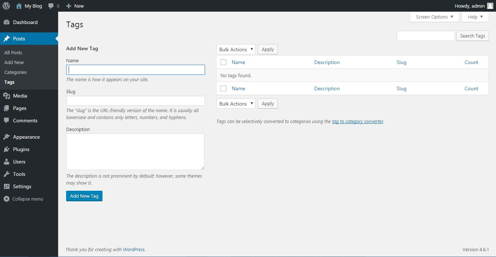

# Kategori dan Tagar

Ada dua car untuk mengelompokan topik post di dalam wordpress : Categories dan Tags.

## Kategori

categories digunakan untuk mengelompokan post dalam topik tertentu **secara hierarkis (bertingkat)**. Artinya satu kategori bisa merupakan induk dari kategori lainya. Kategori analog dengan penggunaan `bab` dalam buku. Satu buku bisa memiliki beberapa `bab` dan setiap bab bisa memiliki beberapa `sub-bab`.

Setelah fresh install, kategori yang ada secara default adalah `uncategorized`. Salah satu pengkategorian yang biasa digunakan oleh organisasi kampus adalah `kategori berita` untuk informasi kegiatan kampus.

Menu kategori terdiri dari dua bagian, di sisi kiri adalah form untuk menambahkan kategori, sementara di sisi kanan adalah daftar kategori digunakan untuk mengelola kategori (edit/hapus). 

Form di sebelah kiri memiliki beberapa isian,
* Nama : Nama kategori yang ingin ditambahkan
* Slug : Bentuk pendek dari url, Jika bingung, biarkan muncul secara default/samakan saja dengan nama.
* Parent : Induk dari topik, jika topik ini merupakan anak-an dari topik lain yang lebih luas silahkan pilih disini. Sebagai contoh, topik materi energi, momentum merupakan sub-bab dari topik mekanika. Disini kamu bisa memilih mekanika sebagai parent dari topik energi/momentum
* Description : Berisi deskripsi tentang kategori tersebut (jarang digunakan)

## Tags

tags digunakan untuk mengelompokan post dalam topik tertentu secara mendatar, tidak memiliki hierarkis, tanpa induk. Tags analog dengan penggunaan `indeks` dalam buku. Setiap indeks akan menuju langsung ke halaman tertentu yang mengandung topik tersebut.

Seperti dalam membuat kategori, membuat tags juga dapat dilakukan dengan mengisi form di sebelah kiri. Satu-satunya perbedaan dengan form dari categories adalah form ini tidak memiliki isian parent.
