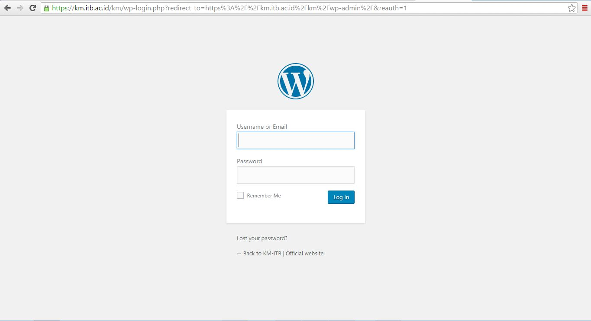

# Login ke panel admin wordpress

Untuk melakukan login ke panel admin wordpress, kamu bisa menambahkan `wp-admin` di bagian akhir nama sebuah website. Selanjutnya wordpres akan me-redirect website yang dibuka ke halaman login yang bersesuain. Sebagai contoh, disini saya membuka halaman login dari `km.itb.ac.id` dengan menambahkan `/wp-admin` di bagian belakang URL websitenya. (http://km.itb.ac.id/wp-admin). Wordpress mengarahkan ulang sehingga muncul tampilan login dari website tersebut

Masukan username dan password yang sudah dibuat pada proses instalasi sebelumnya. Jika kamu lupa, kamu bisa melakukan reset password dengan menekan tombol link reset password.
