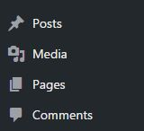

# Menulis Post & Pages

Pada dasarnya wordpress menyediakan 2 jenis post yang dapat dipublikasikan. Hal ini berbeda dengan tumblr yang memiliki 7 jenis post.

2 jenis post dasar ini bisa bertambah/diperluas jika menggunakan plugin/tema tertentu. 

Kedua jenis post tersebut adalah :

#### **Post**

Digunakan untuk informasi yang cukup sering diupdate. Sebagai contoh, informasi tentang kegiatan / berita organisasi lebih cocok jika menggunakan jenis ini karena bisa sangat sering diupdate (misal, 2 minggu sekali). Post dikelompokan menggunakan kategori dan tagar(tags).

#### **Pages**

Digunakan untuk informasi yang jarang diupdate. Sebagai contoh, informasi tentang organigram organisasi, visi-misi organisasi lebih cocok jika menggunakan jenis ini karena sangat jarang diupdate (bisa jadi 1 tahun sekali). Pages dikelompokan secara hierarkis. Artinya satu pages bisa memiliki anak/induk terhadap pages lainya.

**Catatan khusus**
Meskipun kamu bisa menulis post/blog secara langsung sesaat setelah instalasi selesai, saya menyarankan untuk melakukan hal ini setelah menentukan tema wordpress yang ingin digunakan. Hal ini dilakukan karena terdapat perbedaan fitur pada setiap tema wordpress. Artinya, bisa saja sebuah fitur muncul di tema tertentu sementara fitur lain tidak muncul di tema yang lainya. Misalnya, fitur custom logo atau footer-widget. Beberapa tema wordpress seperti TwentySixteen (https://wordpress.org/themes/twentysixteen/) tidak mendukung penggunaan custom logo, sementara tema lainya seperti Nikkon (https://wordpress.org/themes/nikkon/) mendukung penggunaan custom logo. Oleh karena itu, untuk menghindari tampilan layout yang tidak diharapkan karena perbedaan fitur antar tema akibat berpindah-pindah menggunakan tema, saya saranakan untuk menentukan secara pasti satu tema wordpress yang ingin digunakan terlebih dahulu.
