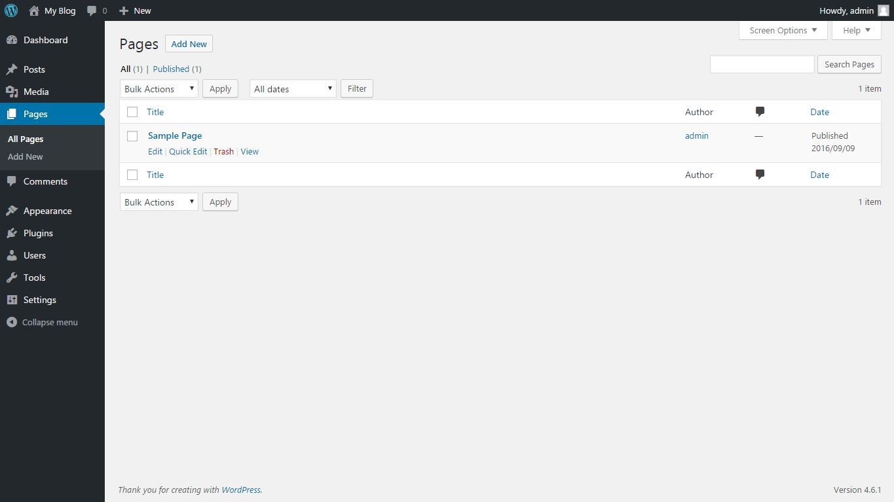
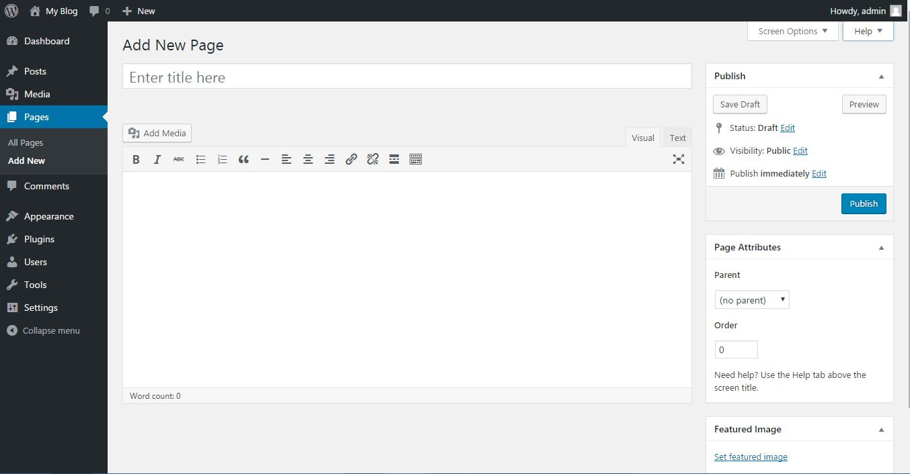

# Pages

Membuat pages kurang lebih sama seperti membuat post. Perbedaanya pengelompokan pages dilakukan secara hierarkis (bertingkat), artinya sebuah pages biasanya meng-induk pada pages lainnya.

Satu-satunya perbedaan pages dengan post adalah penggunaan page Attributes. Kolom Page attributes digunakan untuk mengedit induk dari pages yang sedang diedit. 