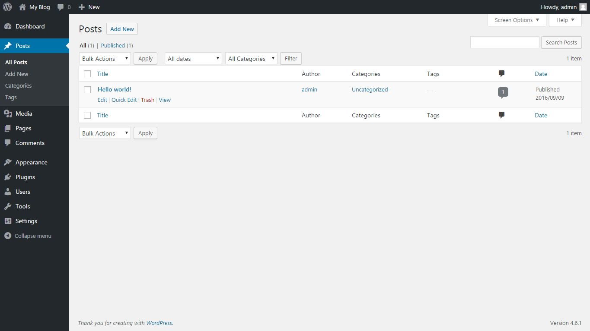

## Post

Untuk menulis post, kamu bisa menekan tombol post di bagian sidemenu sebelah kiri

Pada bagian ini kamu dapat melihat daftar post yang sudah kamu buat. Kamu bisa mencari post dengan fitur search di bagian kanan atas, atau mem-filter berdasarkan kategori atau tanggal tertentu. Selain itu kamu juga bisa melakukan pengelolalaan post secara massal (bulk actions), misal untuk menghapus massal post yang sudah tidak relevan, atau melakukan edit massal postingan lama.

### Membuat Post Baru

Tekan tombol add new post. Kamu akan dibawa ke sebuah halaman baru untuk menambahkan postingan baru di wordpress seperti berikut

Pada gambar diatas terdapat 3 bagian 

* A : Bagian utama berfungsi untuk mengedit konten
* B : Bagian manajemen post, berfungsi untuk mengatur hal-hal yang berkataitan dengan post yang dibuat seperti tanggal publish, apakah bisa dilihat publik / private, dst (akan dijelasakan lebih detail)
* C : Bagian tambahan untuk memunculkan menu-menu tambahan yang jarang diakses (advanced)

Mari kita mulai pembahasanya dari yang paling mudah yaitu bagian A. Bagian A adalah bagian utama dari editor post dalam wordpress. Disini dapat dibagi-bagi lagi menjadi beberapa bagian

Pada gambar diatas terdapat 4 bagian 

* A : Untuk menulis judul post yang dibuat, setelah menulis judul, biasanya wordpress akan secara otomatis menghasilkan link (permalink) menuju post tersebut
* B : Digunakan untuk menyisipkan media, bisa berupa video, gambar, atau rekaman suara
* C : Toolbar untuk konten, bisa digunakan untuk **menebalkan tulisan**, *garis miring* atau ~mencoret teks~ dst..
* D : Bagian utama dari konten yang dibuat, seluruh konten tulisan diketik pada kolom ini

Selanjtnya, bagian B (Manajemen Post) terdiri dari beberapa kolom. 

Kolom pertama berhubungan dengan publikasi dari konten, disini kita bisa menentukan apakah tulisan yang sudah ditulis ingin disimpan sebagai draft, apakah tulisan ingin dapat diakses publik/hanya diri sendiri, dan apakah tulisan langsung dipublish saat ini juga atau dijadwalkan agar muncul setelah tanggal/jam tertentu.

Kolom kedua tentang kategori dan tag. Disini kamu bisa menentukan kategori atau tag yang kamu buat

Kolom ketiga tentang featured images. Seperti namanya, featured images biasanya digunakan oleh beberapa tema tertentu untuk menampilkan preview/gambar dari post.

Sebagai contoh, Tema "twenty fourteen" (https://wordpress.org/themes/twentyfourteen/) adalah contoh tema yang mendukung fitur featured images

dapat dilihat dalam tema twenty fourteen diatas, setiap post memiliki gambar yang berasosiasi dengan post tersebut.

Terakhir, mari kita ke fokus ke bagian C Jika ditekan, maka bagian C akan menampilkan pilihan checkbox untuk memunculkan / menyembunyikan fitur-fitur ekstra seperti komentar terhadap post, extra field, dll.

