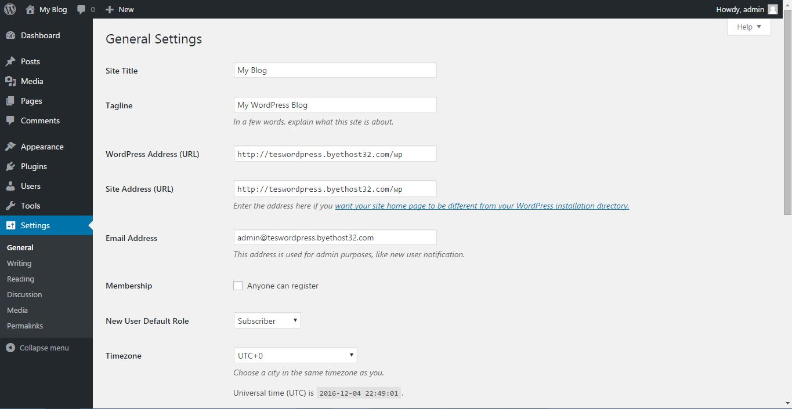
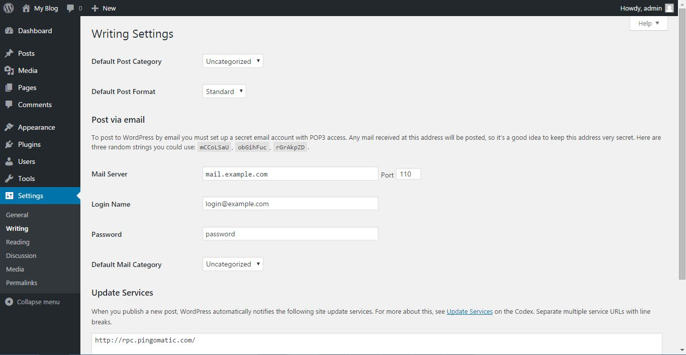
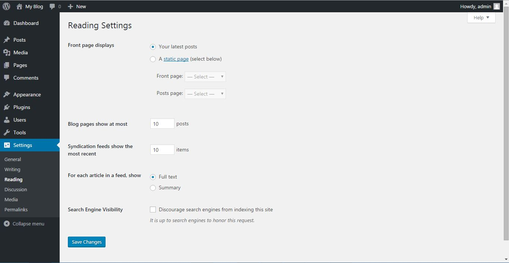
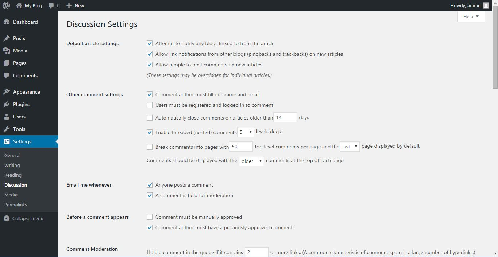
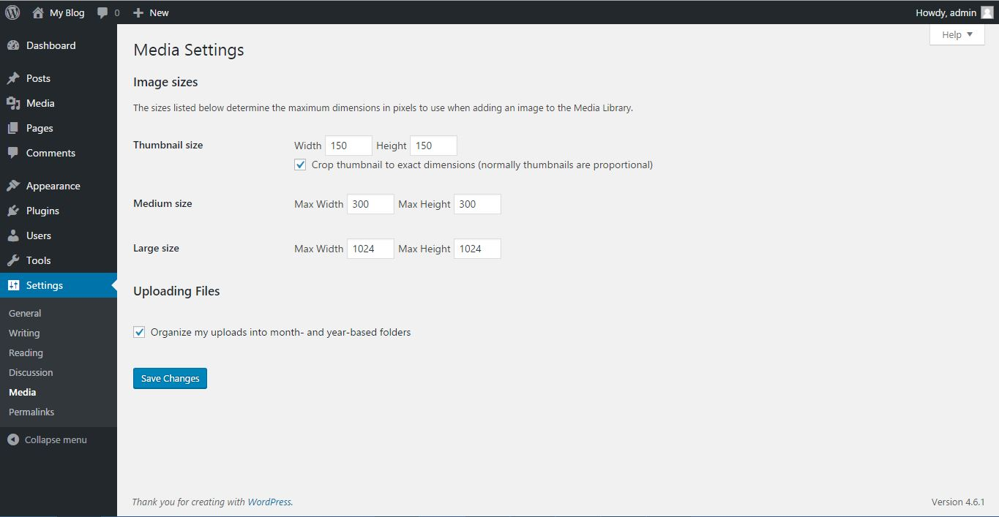
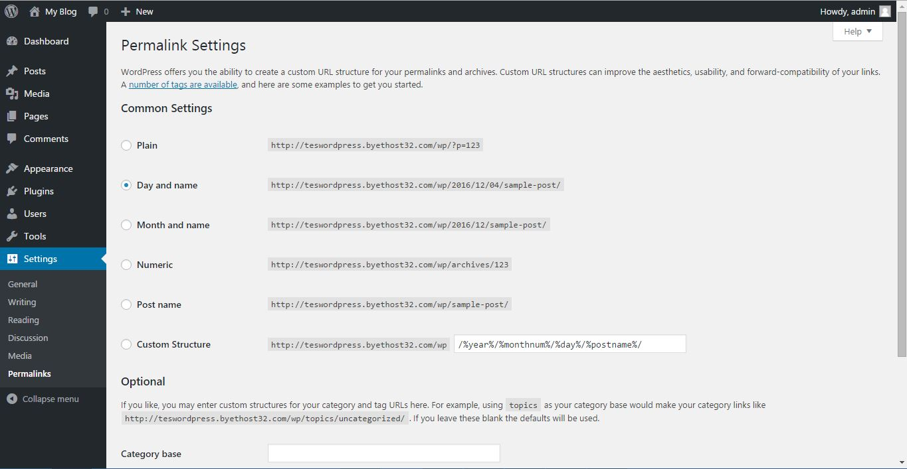

# Konfigurasi Wordpress

Tibalah bagian akhir, bagian yang ~~tidak penting~~ jarang diakses, yaitu bagian konfigurasi. Pada bagian ini ada 6 sub-bagian yaitu
1. General : Konfigurasi umum
2. Writing : Konfigurasi yang berkaitan dengan proses menulis
3. Reading : Konfigurasi yang berkaitan dengan bagaimana tulisan dipublikasikan
4. Discussion : Konfigurasi yang berkaitan dengan komentar
5. Media : Konfigurasi yang berkaitan dengan media (gambar,video dan audio)
6. Permalink : Konfigurasi yang berkaitan dengan format link

## General

Disini kamu bisa menentukan nama website, tagline website dst..

## Writing

Disini kamu bisa menentukan kategori default saat menulis atau format post default saat menulis. Kamu juga bisa menulis wordpress via email (jarang digunakan)

## Reading

Disini kamu akan menentukan bagaimana post kamu ditampilkan. **Catatan penting**, beberapa tema wordpress memiliki konfigurasi tertentu yang mengharuskan kamu menampilkan halaman statis di bagian depan website. Jadi, jika tampilan tema tidak sesuai dengan apa yang diharapkan, pastikan bahwa tema tersebut memiliki konfigurasi yang tepat khususnya tentang bagaimana front pages dari tema tersebut ditampilkan.

## Discussion

Disini kamu bisa mengedit apakah sebuah post boleh diberikan komentar/tidak. Untuk menghindari spam, saya lebih sering menonaktifkan kolom komentar.

## Media

Disini kamu bisa mengatur tentang ukuran default media. Saya lebih sering membiarkanya sebagaimana default settings.

## Permalink

Dsini kamu bisa mengkonfigurasi bagaimana link dalam website kamu ditampilkan. Apakah menggunakan tanggal post tertentu atau langsung ke judul post. Saya lebih prefer menggunakan judul post dibanding tanggal karena lebih enak dibaca.

