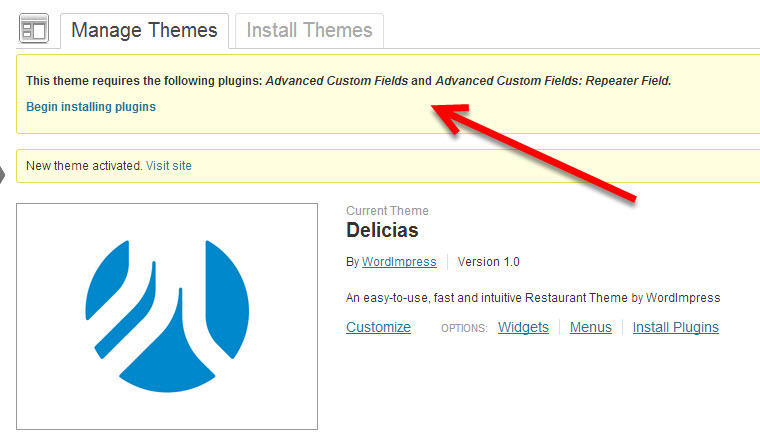

# Konsep Umum Wordpress

Saat ini Wordpress telah berkembang pesat dari semula hanya sebagai platform untuk menulis post blog, sekarang wordpress dapat digunakan untuk fungsi-fungsi lain yang lebih kompleks. Sebagai contoh, kamu bisa membuka toko online dan menerima pembayaran dari wordpress. Itu semua karena wordpress mendukung penggunaan plugin. Plugin didefinisikan sebagai sesuatu yang dapat memperluas fungsionalitas wordpress. Widget bisa dianggap sebagian dari "jenis plugin" yang **menampilkan sebuah konten** pada setiap halaman. Jadi secara naif kamu bisa mengatakan widget pasti plugin tapi plugin belum tentu widget. Di luar hal itu semua, sebenarnya kamu tidak perlu merisaukan pemahaman kamu dengan **definisi** plugin vs widget. 

Karena ada banyak plugin yang ada di dunia ini, jelas saya tidak bisa jelaskan semuanya satu per satu. Kamu hanya perlu membaca dokumentasi cara penggunaan plugin pada halaman plugin yang bersesuaian.

Pengelolaan plugin bisa diakses melalui sidemenu di sebelah kiri pada panel admin :

disini kamu bisa mengelola plugin yang ada untuk meng-uninstall / upgrade versi plugin / aktivasi - deaktivasi plugin yang sudah ada. Jika kamu ingin meng-install plugin baru, kamu bisa menekan tombol `add new plugin` di bagian atas :

Seperti instalasi tema di wordpress, kamu tinggal mencari plugin yang kamu butuhkan dan menekan tombol install pada plugin yang bersesuaian. Seluruh plugin yang kamu search disini adalah plugin gratis. 

Jika kamu merasa fungsionalitas yang kamu inginkan tidak ada pada plugin gratis-an (padahal plugin gratis-an udah banyak banget). Kamu bisa mencoba mencari premium plugin (berbayar) di :
* CodeCanyon (https://codecanyon.net/popular_item/by_category?category=wordpress)
* WPMUDev (https://premium.wpmudev.org/projects/category/plugins/)
* ElegantThemes (https://www.elegantthemes.com/plugins/)
* dan masih banyak lagi.. cukup search premium wordpress plugin di google

Nah seperti yang sudah saya katakan di awal, pada dasarnya sidemenu wordpress hanya ada seperti yang sudah saya jelaskan di [Dashboard Wordpress](../Bagian-3/Dashboard Wordpress.md). Akan tetapi setelah kamu install beberapa plugin tertentu, sidemenu panel admin kamu **mungkin** akan bertambah menu-nya menjadi lebih banyak seperti ini :

Sekedar catatan, ada beberapa tema yang *menyertakan plugin*. Jadi saat kamu menginsall tema tersebut secara tidak sadar ada sebuah plugin yang terinstall. Di sisi lain, ada juga beberapa tema wordpress yang *membutuhkan instalasi plugin* tertentu. Jangan khawatir, jika tema yang kamu install membutuhkan plugin tertentu, akan ada warning message yang meminta kamu untuk menginstall plugin yang dibutuhkan.

