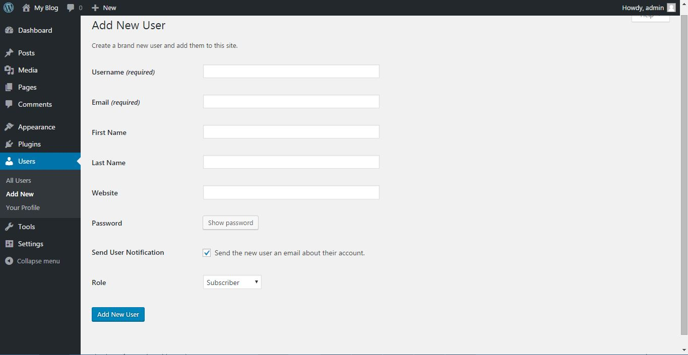
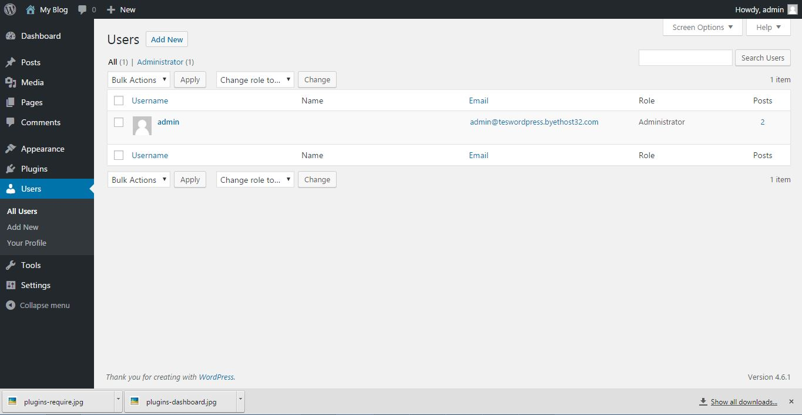
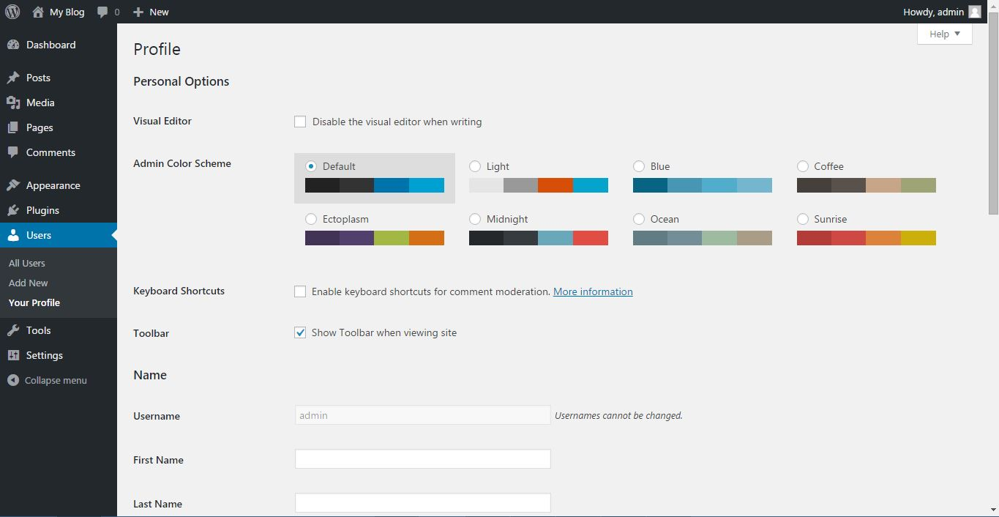

# Manajemen Pengguna

Pada dasarnya wordpress mendukung beberapa penulis untuk berkolaborasi menulis bersama. Untuk melakukanya kamu bisa menambah user baru melalui sidemenu bagian `add new	user`

Disini kamu bisa mengisi form tersebut, satu hal yang perlu dicatat bahwa wordpress mendukung penggunaan role dalam pembuatan user. Setiap role berkaitan dengan hak tertentu dalam pengelolaan sebuah website wordpress. Pada dasarnya, wordpress mendukung 6 jenis role :

1. Super Administrator : Memiliki hak paling tinggi, bisa dianggap rajanya para admin. Peran super administrator hanya berlaku jika website wordpressnya menggunakan fitur multi site. (Jarang digunakan)
2. Administrator : Memiliki hak administratif seperti mengelola tema, plugin, membuat user baru, dst. Setelah kamu melakukan instalasi,amu akan diberikan hak akses level ini.
3. Editor : Seperti namanya, dia dapat menulis, mempublikasikan tulisanya sekaligus juga mengatur mereview & mempublikasikan tulisan orang lain. Editor bisa mempublikasikan tulisan level author/kontributor.
4. Author : Level peran ini hanya dapat menulis dan mempublikasikan tulisan milik dia sendiri, tidak seperti editor yang dapat mempublish tulisan orang lain.
5. Contributor : Kontributor hanya dapat menulis tulisan, tapi tidak bisa mempublikasikan tulisanya. Tulisan milik kontributor hanya dapat dipublikasikan oleh editor / level akses yang lebih tinggi.
6. Subscriber : Pembaca tidak dapat menulis, satu-satunya yang bisa dia lakukan adalah mengatur profil pengguna di website tersebut seperti ganti foto profile, ganti password dll.

Sekedar catatan ada beberapa plugin yang menambahkan role lain sesuai kebutuhan plugin. Jadi mungkin saja setelah kamu menginstall plugin tertentu role-nya bertambah banyak.

Setelah menambah user baru, kamu bisa mengatur masing-masing user di bagian `All Users` pada side menu

Terakhir, kamu bisa mengedit profil yang kamu gunakan untuk web ini. Disini kamu bisa mengganti profile picture, personalisasi skema warna panel admin, atau mengganti password dst.

