# Mengatur Penampilan Wordpress

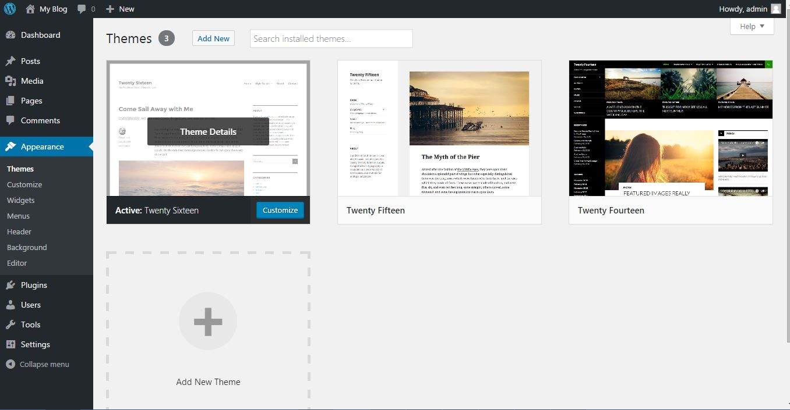

Tentunya kamu tidak puas jika tampilan dari website organisasi kamu seadanya, default dari wordpress. Untuk mengkostumisasi tampilan wordpress, hal pertama yang harus kamu lakukan adalah menentukan tema (themes). Di dalam menu ini kamu bisa melihat tema apa yang sudah ter-install di website kamu sekaligus juga memilih tema mana ingin yang diaktifkan.

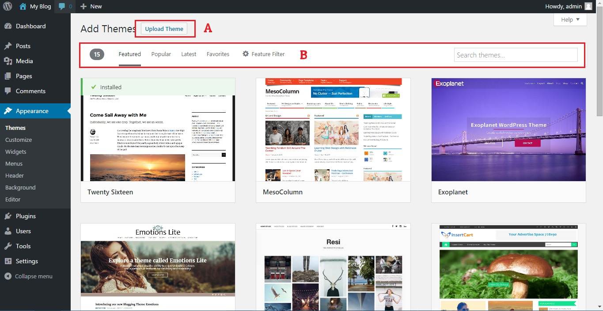

Jika kamu tidak puas dengan tema yang ada, kamu bisa menambah (meng-install) tema baru melalui tombol add-new themes. Kamu akan dibawa ke daftar tema-tema gratis yang dapat kamu install.
* A : Digunakan untuk mencari / mem-filter tema sesuai dengan fitur tertentu
* B : Digunakan sebagai alternatif untuk men-install manual tema yang sudah pernah didownload. Menu ini juga digunakan untuk meng-install theme premium (berbayar) jika kamu sudah membeli themesnya. Atau menginstall theme yang dibuat oleh developer lokal.

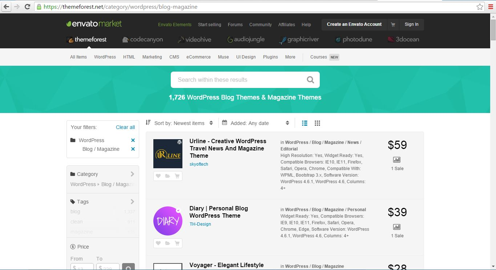

Jika kamu tidak puas dengan tema gratisan yang ada, kamu bisa mencoba untuk membeli tema berbayar. Setelah kamu membayar, kamu dapat meng-upload tema tersebut dengan tombol upload themes. Kamu dapat membeli tema berbayar di :
* Envato Market - ThemeForest (https://themeforest.net/category/wordpress/blog-magazine)
* Studio Press (http://www.studiopress.com/)
* Theme fuse (https://themefuse.com/)
* Theme trust (https://themetrust.com/)
* dan banyak lagi.. cukup search di google "premium wordpress theme"

## Kustomisasi tema

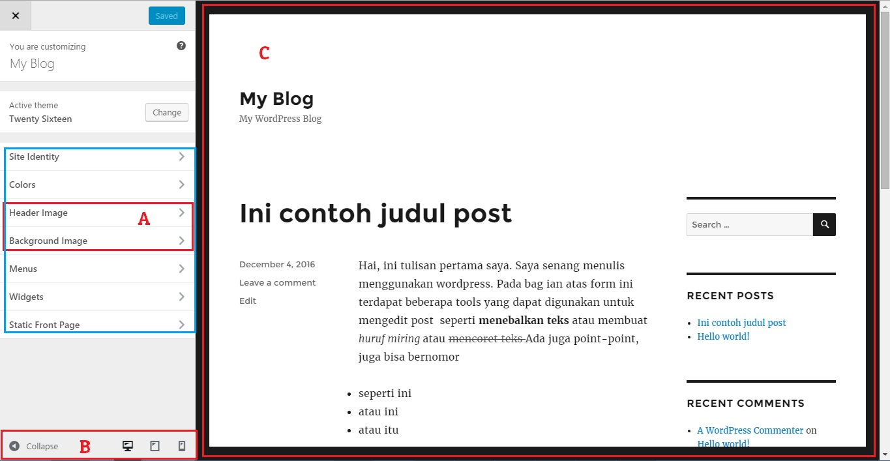

Setelah menentukan tema, hal yang perlu dilakukan adalah mengkustomisasi penampilan temanya. Setiap tema memiliki fitur yang berbeda-beda, tapi secara default hampir selalu pasti ada beberapa fitur yang paling umum digunakan. Fitur-fitur tersebut antara lain Header Image, Background Image. Kamu bisa mengakses kustomisasi ini melalui tombol `customize` atau mengklik menu `header image` atau `background image`. Tombol Customize akan membawa kamu ke editor visual untuk melihat tampilan website kamu setelah mengubah-ubah parameter.

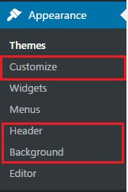

* A : Digunakan untuk mengganti header / bacgkround image tema
* B : Menu untuk melakukan pratinjau website jika dilihat di komputer (desktop PC) / Tablet / Mobile Phone
* C : Pratinjau (Preview) setelah mengkustomisasi parameter dari tema yang diaktifkan

Sekedar catatan, dalam diagram diatas menu yang didalam kotak biru menunjukan fitur-fitur yang didiukung oleh tema yang sedang aktif. Dalam kasus ini, tema tersebut mendukung kostumisasi warna, menu, widget dan halaman utama statis. Fitur-fitur ini mungkin berbeda jika kamu menggunakan tema lainya (Terutama tema berbayar).

## Menu
Suatu tema pada umumnya mendukung penggunaan menu. Setiap tema bisa saja memiliki beberapa lokasi menu. Sebagai contohnya website himpunan mahasiswa geologi "GEA" itb (http://gea.itb.ac.id) menggunakan tema wordpress yang mendukung hanya 1 buah lokasi menu :

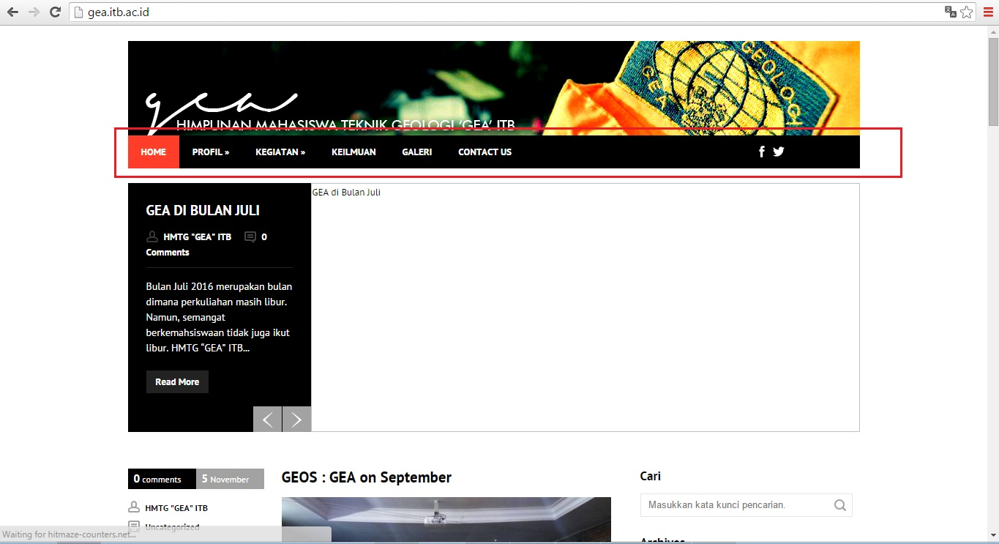

sementara itu, website Network Information Center (NIC - http://nic.itb.ac.id) itb menggunakan tema wordpress yang mendukung 2 buah lokasi menu :

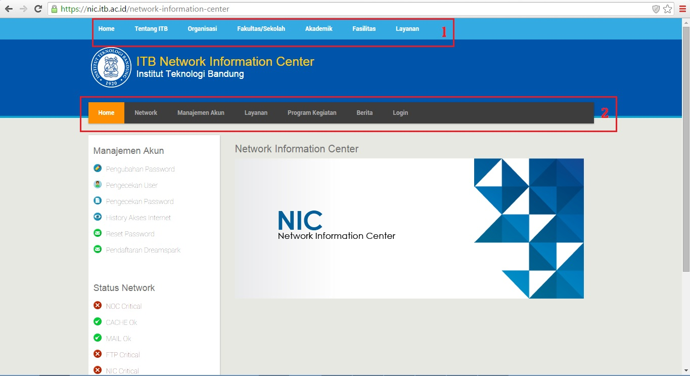

Karena setiap tema memiliki jumlah menu dan lokasi menu pada layout yang berbeda, saya sarankan untuk menentukan tema terlebih dahulu sebelum mengkonfigurasi menu yang ditampilkan.

Setelah menentukan tema, untuk mengedit/mengubah menu dapat dilakukan dari 2 lokasi, pertama dari menu customize (Lihat bagian yang dihighlight biru pada gambar sebelumnya, terdapat pilihan `menu`) atau yang kedua menggunakan pilihan pada sidemenu di halaman admin. Kali ini saya akan membahas tentang manajemen menu jika mengelolanya melalui sidemenu. 

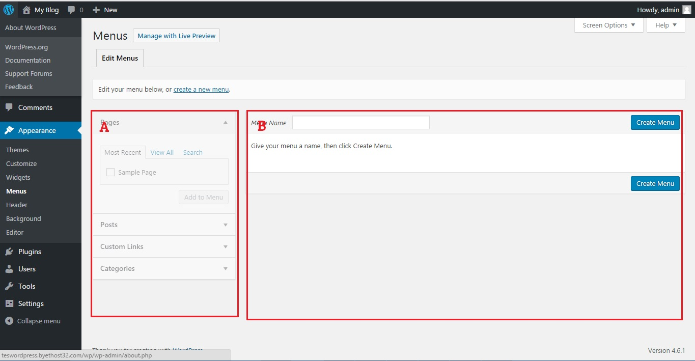

Berbeda dengan `Categories` (yang memiliki kategori default `uncategorized`, menu tidak memiliki `menu` default. Sehingga tampilan pertama setelah instalasi bersih adalah seperti gambar diatas. Ada dua bagian utama dalam section menu :

* A : Berfungsi untuk menampilkan daftar post/pages/kategori/custom link yang sudah ada
* B : Berfungsi untuk mengedit menu.

Hal pertama yang harus dilakukan adalah membuat `set menu`. Seperti namanya, set menu adalah himpunan dari link/kategori/post/pages yang ingin ditampilkan dalam website. Untuk membuat `set menu` baru, tulis sebuah nama bebas. Misal dalam kasus ini saya beri nama `set menu 1`. Tekan tombol create menu.

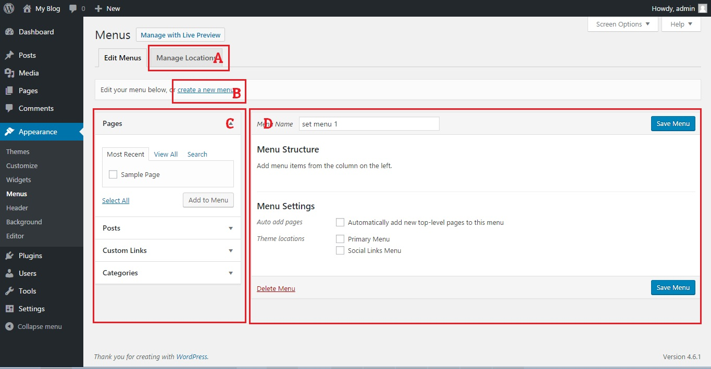

Disini akan muncul beberapa bagian baru, bagian A digunakan untuk mengelola `set menu` yang diaktifkan untuk ditampilkan di website. Jadi, di dalam wordpress membuat `set menu` tidak berarti `set menu` tersebut langsung aktif dan muncul di website. Bisa saja satu website memiliki beberapa jenis `set menu` yang akan ditampilkan jika terdapat event-event tertentu (misal set menu diskon saat hari kemerdekaan 17 agustus). Dengan demikian, `set menu` yang tidak aktif akan disembunyikan jika tidak terdapat even-event terentu.

Bagian B digunakan untuk membuat `set menu` baru lainya.

Bagian C & D sudah dijelaskan sebelumnya

Hal selanjutnya yang harus kamu lakukan adalh menambahkan konten yang sudah dibuat ke set menu tersebut. Ada 4 jenis link yang dapat kamu tambahkan ke `set menu`.
1. Pages : Halaman-halaman yang sudah pernah dibuat, Biasanya halaman visi-misi, halaman konta/about us.
2. Post : Postingan spesifi yang sudah dibuat, biasanya informasi berupa pengumuman penting jika ingin diperhatikan secara khusus ditambahkan ke menu ini
3. Custom Links : Link umum secara bebas, bisa internal di dalam website yang dikelola atau link eksternal seperit akun instagram/facebook dari organisasi yang dibuat
4. Categories : Menampilkan kelompok post dari kategori yang pernah dibuat. Biasanya berita oragnisasi.

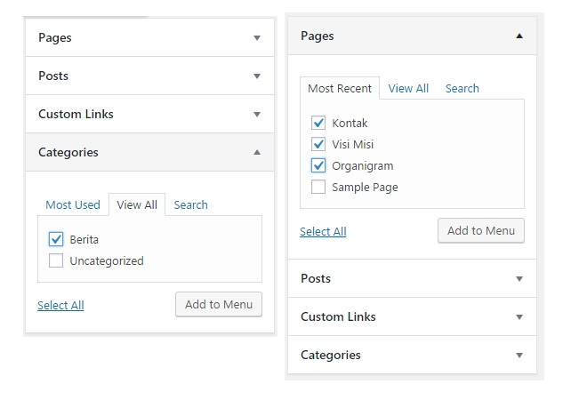

untuk melakukanya, pilih checkbox disamping nama pages (halaman) / categories, tekan tombol add. `set menu` yang sedang dibuat akan mengandung halaman/post/kategori/link yang kita tambahkan tadi.

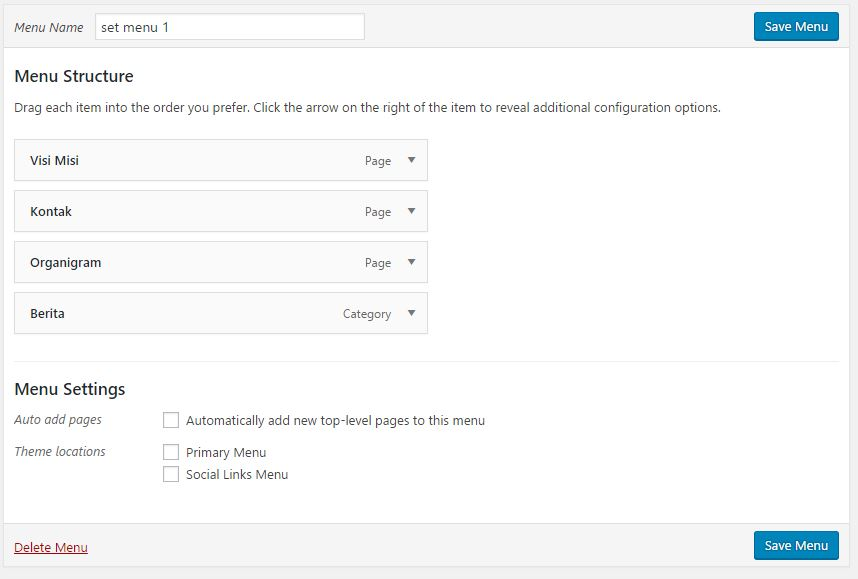

Kamu bisa juga membuat sebuah menu memiliki induk menu lainya. Untuk melakukanya kamu cukup melakukan drag-and-drop menu untuk bergeser ke kanan / kiri agar menjadi sub-menu dari suatu menu. Dalam kasus disini saya mencontohkan menu `visi & Misi` menjadi parent menu dari menu `kontak` dan `organigram`. Jangan lupa tekan tombol save

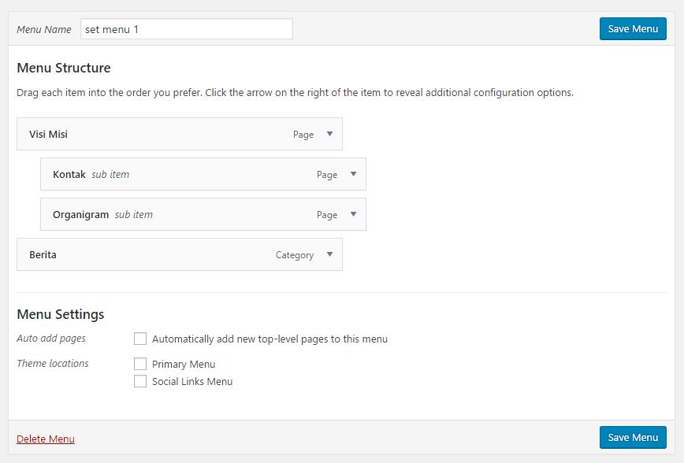

Kamu juga bisa menambahkan `set menu` baru menggunakan link `create new menu`. Lakukan hal yang sama seperti yang sudah dilakukan diatas. Biasanya membuat lebih dari satu `set menu` dilakukan jika tema / themes yang kita gunakan mendukung fitur lebih dari 1 lokasi tema (seperti website NIC dalam contoh diatas). Jika kamu memiliki dua atau lebih `set menu`, tampilan manajemen menu akan berubah seperti berikut: 

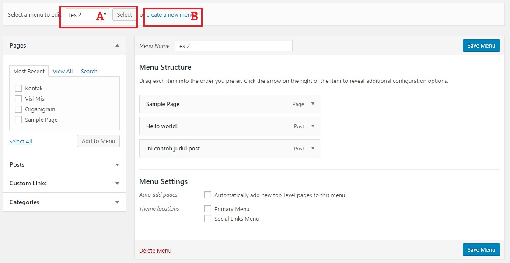

Perhatikan, dalam contoh diatas saya memiliki 2 set menu, set menu pertama saya beri nama `set menu 1` sementara set menu kedua saya beri nama `tes 2`. Bagian A digunakan untuk memilih set menu yang diedit sementara bagian B digunakan untuk membuat set menu baru.

Terakhir, setelah kamu puas membuat set menu, hal harus kamu lakukan adalah mengaktifkan `set menu` agar bisa ditampilkan di website. Klik manage location pada section ini.

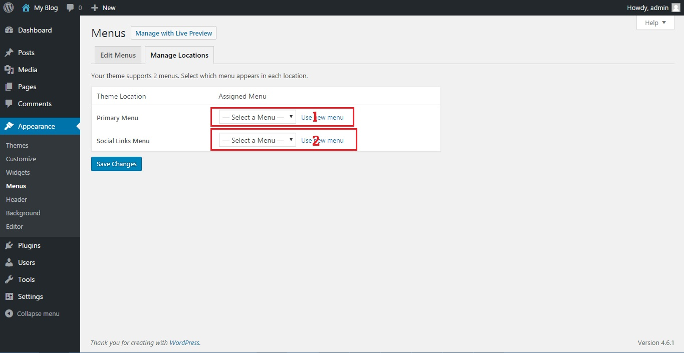

Ternyata tema yang saya gunakan mendukung 2 lokasi menu. Beberapa tema lain mungkin hanya menndukung satu lokasi menu. Oleh karena itu jangan khawatir jika ada sedikit perbedaan dalam bagian ini.

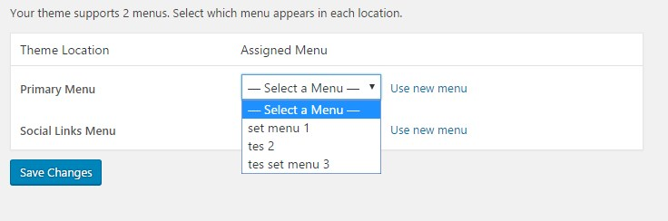

Perhatikan, bahwa semua set menu yang pernah saya buat akan muncul sebagai dropdown pada pilihan aktivasi menu diatas. Silahkan pilih menu yang ingin diaktifkan, jangan lupa tekan tombol save.

Jika kamu bingung dimana tampilan visual lokasi menu dalam layout tema yang kamu gunakan, kamu bisa melakukanya dengan metode `Manage with live preview` atau melalui menu `customize` seperti yang sudah dijelaskan sebelumnya.

*&ast; Catatan : Di beberapa wordpress / tema versi lama, jika menu belum diaktifkan maka secara default `pages` yg pernah dibuat menjadi `menu`. Akibatnya, bisa jadi pages yang muncul bertumpuk dan merusak layout tema. Oleh karena itu, saya menekankan untuk menggunakan `pages` dan `post` sesuai dengan tujuanya (pages untuk yang jarang diupdate seperti organigram,visi misi,halaman kontak. Post untuk informasi yang sering diupdate seperti berita).*

## Widget 

Widget adalah perluasan fungsi wordpress yang ditampilkan secara visual di setiap halaman. Agar lebih kebayang, saya berikan salah satu contohnya. Pernahkah kamu mengunjungi sebuah website yang di dalamnya terdapat timeline twitter ? Ya, itu adalah salah satu contoh widget. Pada dasarnya wordpress tidak menampilkan timeline twitter di dalam sebuah website. Tapi setelah ditambahkan widget khusus timeline twitter, website tersebut mampu menampilkan timeline twitter dari akun tertentu. Perhatikan contoh penggunaan di bawah :

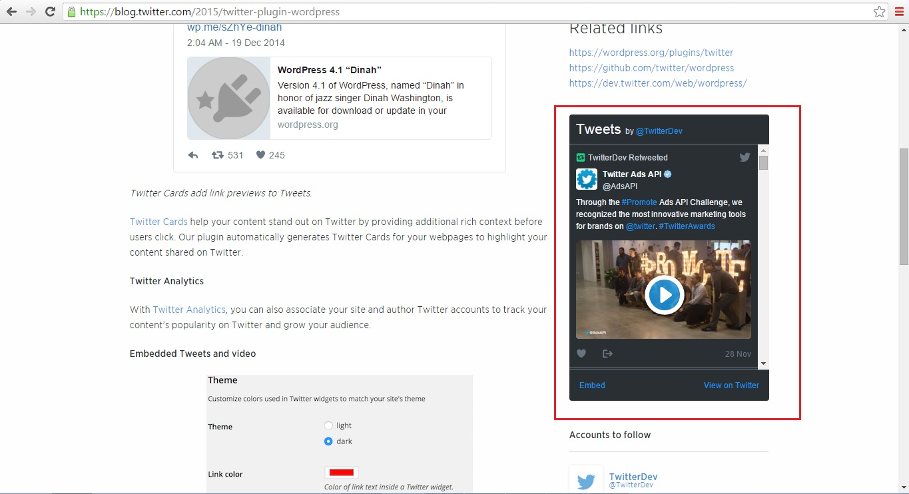

Kamu bisa mengatur widget yang digunakan melalui 2 metode. Metode pertama dengan mengaturnya pada bagian `Customize`, metode kedua dengan akses dari sidemenu di halaman admin. Kali ini saya akan membahas mengatur widget dengan melalui sidemenu

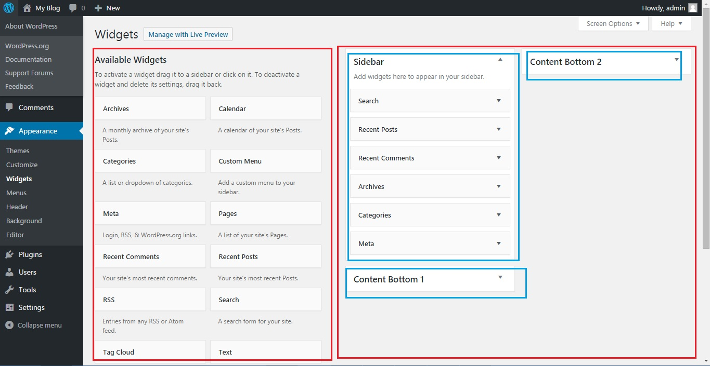

Pada diagram diatas, bagian kiri berisi widgets yang tersedia / sudah terinstall di dalam wordpress sementara bagian kanan berisi lokasi-lokasi yang disupport oleh tema ini. Kebetulan tema ini mendukung 3 lokasi widget. Setiap tema memiliki perbedaan jumlah lokasi widget yang di dukung.

Untuk menginstall widget baru, kamu bisa melakukanya melalui halaman plugin (akan dijelaskan nanti). Di sisi lain, kadang-kadang ada beberapa tema yang memiliki widgets bawaan. Oleh karena itu, saya sarankan untuk menentukan tema terlebih dahulu sebelum melakukan kustomisasi ini.

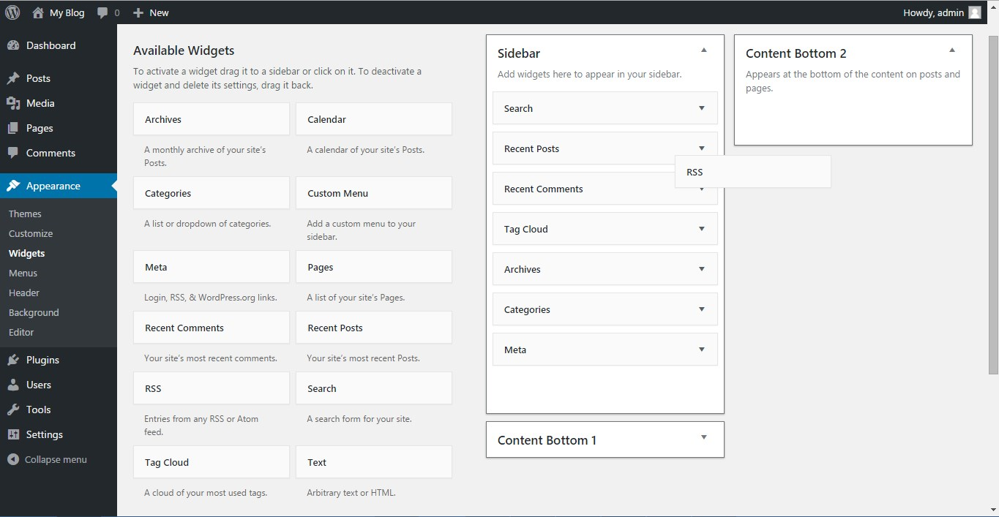

Untuk mengaktifkan widget, kamu cukup melakukan drag dari sisi sebelah kiri dan drop ke salah satu lokasi di bagian kanan

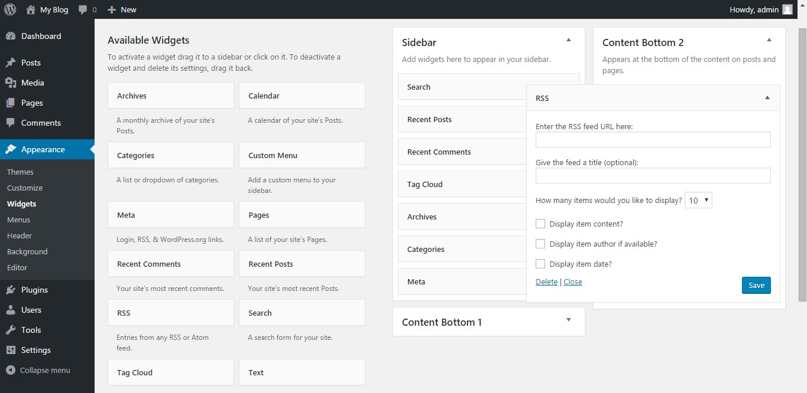

Setiap widgets memiliki konfigurasi tertentu. Dalam kasus diatas, saya ingin menambahkan widgets RSS (Silahkan di google sendiri apa itu RSS). Sesaat setelah widget di-drop, kita harus mengkonfigurasi widget tersebut sesuai parameter yang dibutuhkan. Karena setiap widget berbeda parameter satu sama lain, saya tidak bisa memberi contoh untuk semua kasus. Hal yang harus kamu lakukan adalah membaca petunjuk instalasi widget yang kamu gunakan. Jangan lupa tekan tombol save